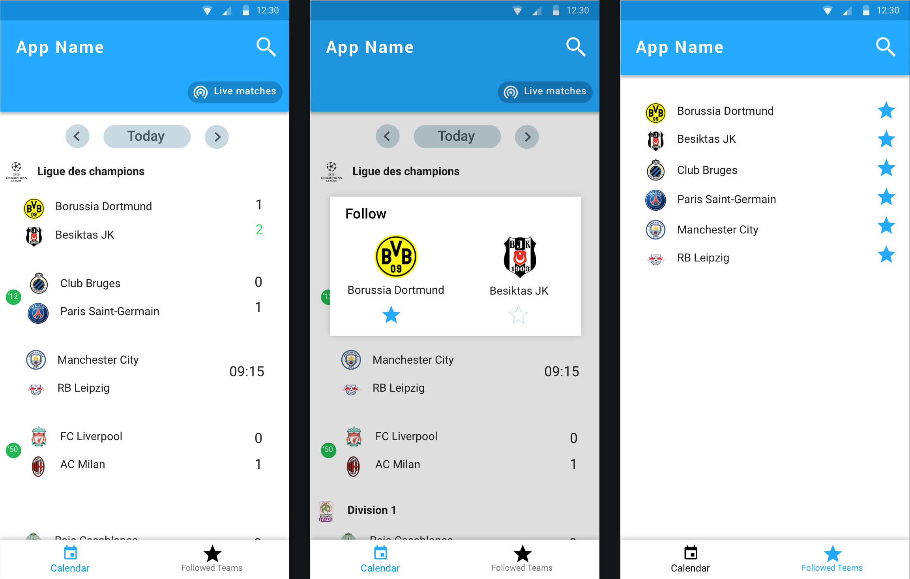

## Introduction
The coding challenge(s) below will be used to assess your familiarity with the Android
development environment, relevant Android related frameworks and general coding best
practices. There are no hard time limits, but we’re trying to keep the scope limited so we don’t
occupy too much of your time. We will not use any of the results at Elbotola. Our aim is to have an
efficient and fair assessment: you spend time solving the challenge, and we spend time giving
you detailed feedback.

The assessment consists of two pages:

- Calendar Page to list the matches by date
- and Follow Page to list the followed teams

## Screenshots

## Apk

### Modules Required
- Preferably Kotlin (otherwise JAVA)
- No depenencies required, feel free to choose the stack you're confortable with

## Pages
### Calendar Page
- List Matches by date, grouped by competition and ordered by time,
- You render the match based on its status (match.match_details.match_status)
- Date Switcher
- Live Matches Toggle which shows currently playing matches if available, otherwise show an appropriate message
- You can follow a team when you click on the match model
- User uses Search Bar to filter competition names or team names

### Follow Page:
- List all Followed Teams
- You unfollow the team by toggling the star icon
- a search bar to filter the content
